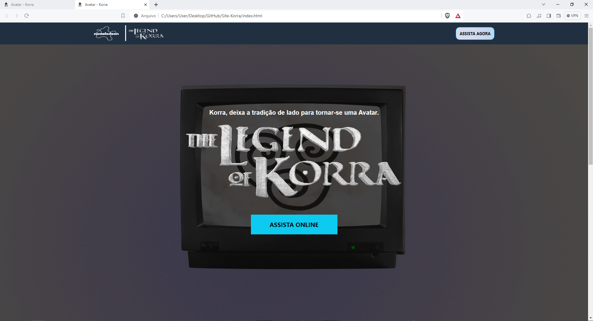
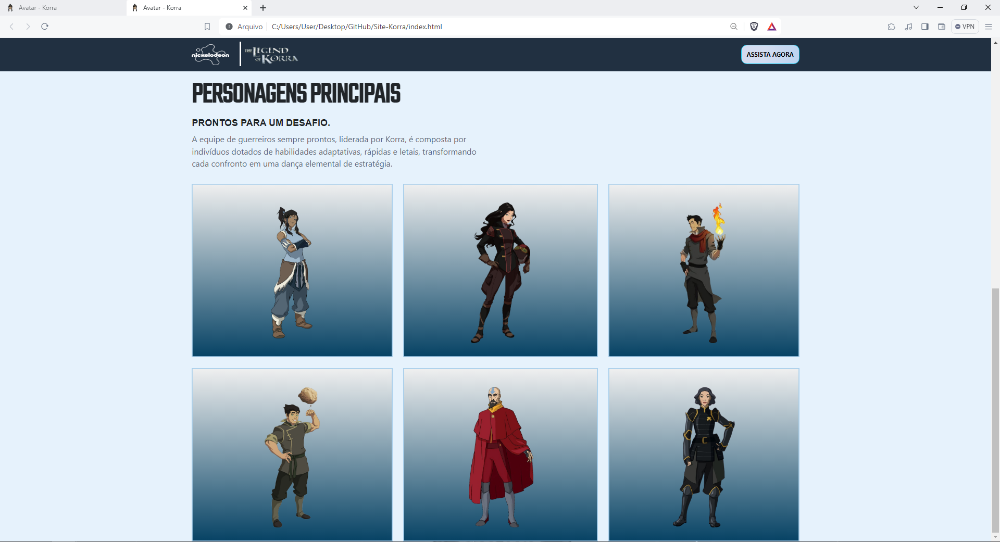
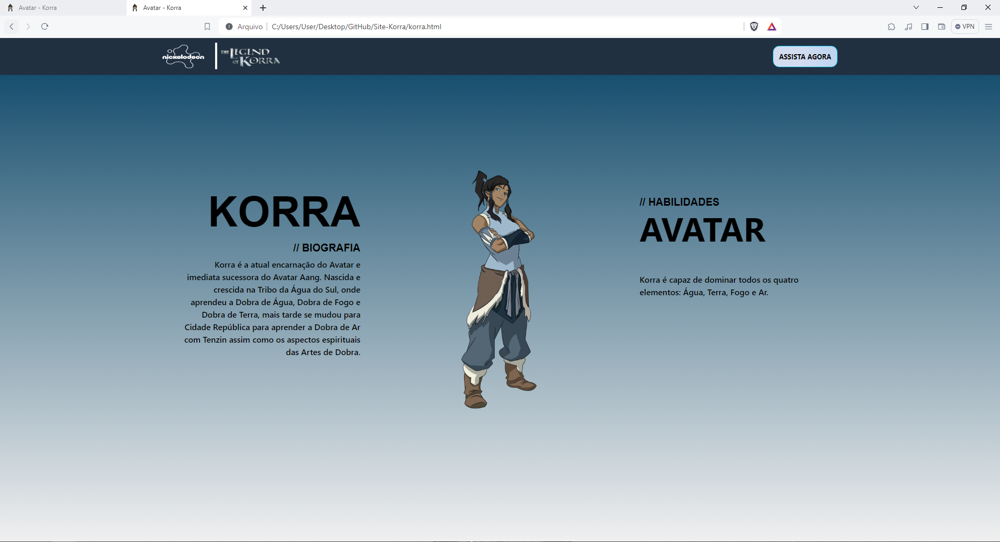

# Site-Korra
Realizei um dos desafios propostos pela Comunidade Codelândia, porém com a temática de Avatar: A lenda de Korra. Neste projeto eu utilizei o Bootstrap, aplicando conceitos de barra de navegação, divisões de tela, media queries, alinhamento, botões, breakpoints, entre outros.

Segue abaixo prints de algumas telas do site.

Home:

Home scroll down:

Página de personagem:

